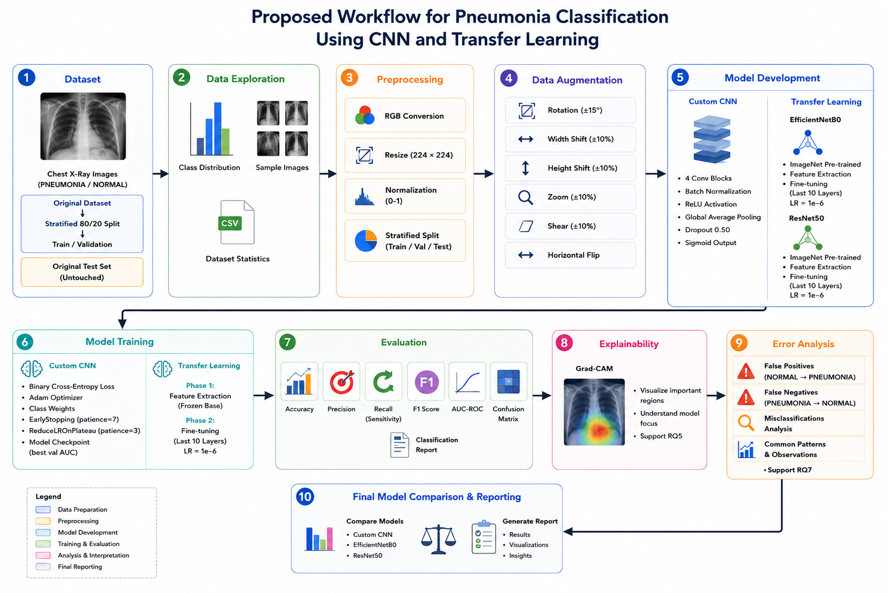

# Chest X-Ray Pneumonia Detection

## Overview

This project develops and evaluates deep learning models for automated pneumonia detection from chest X-ray images. A custom Convolutional Neural Network (CNN) is compared against two transfer learning architectures, EfficientNetB0 and ResNet50, using a publicly available medical imaging dataset.

Beyond standard classification performance, the project investigates model interpretability through Grad-CAM visualizations and detailed error analysis to better understand clinically relevant prediction behavior.

---

## Project Highlights

* Custom CNN baseline architecture
* Transfer Learning with EfficientNetB0 and ResNet50
* Stratified train-validation splitting
* Medical image augmentation
* Class imbalance handling through class weighting
* Multi-metric model evaluation
* Grad-CAM explainability
* Misclassification and error analysis
* Model comparison and reporting
* Automated export of figures, models, and evaluation outputs

---

## Dataset

**Dataset:** Chest X-Ray Images (Pneumonia)

Source:

https://www.kaggle.com/datasets/paultimothymooney/chest-xray-pneumonia/data

### Original Dataset Distribution

| Split      | Normal | Pneumonia | Total |
|------------|--------:|----------:|-------:|
| Train      | 1,341 | 3,875 | 5,216 |
| Validation | 8 | 8 | 16 |
| Test       | 234 | 390 | 624 |
| **Total**  | **1,583** | **4,273** | **5,856** |

The original validation set contains only 16 images, making it unsuitable for reliable model selection, early stopping, and learning-rate scheduling.

Therefore, a **stratified 80/20 split** of the original training set is used to create a statistically meaningful validation subset while keeping the original test set untouched for final evaluation.

### Working Dataset

| Subset | Images |
|---------|--------:|
| Train | 4,173 |
| Validation | 1,043 |
| Test | 624 |

---

## Research Questions

| Number | Question |
|---|----------|
| RQ1 | How effectively can a custom CNN classify pneumonia from chest X-ray images? |
| RQ2 | To what extent do transfer learning models outperform a custom CNN across accuracy, recall, F1-score, and AUC-ROC? |
| RQ3 | Can class weighting mitigate the impact of class imbalance on false negative predictions? |
| RQ4 | How do evaluation metrics affect pneumonia classification assessment? |
| RQ5 | What insights can Grad-CAM provide about model decision-making? |
| RQ6 | Does data augmentation improve model generalization? |
| RQ7 | What patterns appear in misclassified chest X-ray images? |

---

## Workflow

The complete project workflow is illustrated below.

<p align="center">
  
</p>

The workflow includes:

1. Dataset preparation
2. Data exploration
3. Image preprocessing
4. Data augmentation
5. Model development
6. Model training
7. Model evaluation
8. Grad-CAM explainability
9. Error analysis
10. Final model comparison and reporting

---

## Data Preprocessing

All chest X-ray images are:

* Converted to RGB format
* Resized to 224 × 224 pixels
* Split using stratified sampling

Model-specific preprocessing is applied:

| Model | Preprocessing |
|--------|--------------|
| Custom CNN | Pixel normalization [0,1] |
| EfficientNetB0 | EfficientNet preprocess_input |
| ResNet50 | ResNet preprocess_input |

---

## Data Augmentation

Data augmentation is applied only to the training set to improve generalization and reduce overfitting.

### Applied Augmentations

* Rotation (±15°)
* Width Shift (±10%)
* Height Shift (±10%)
* Zoom (±10%)
* Shear (±10%)
* Horizontal Flip

Brightness augmentation was excluded after experimentation because it occasionally produced unrealistic intensity variations in chest X-ray images.

---

## Models

### 1. Custom CNN

A lightweight CNN designed specifically for pneumonia classification.

Architecture components:

* Convolutional Blocks
* Batch Normalization
* Max Pooling
* Global Average Pooling
* Dropout Regularization
* Dense Layers
* Sigmoid Output

### 2. EfficientNetB0

ImageNet-pretrained EfficientNetB0 using transfer learning.

Training strategy:

* Feature Extraction
* Fine-Tuning
* Learning Rate Scheduling

### 3. ResNet50

ImageNet-pretrained ResNet50 used as a deeper transfer-learning baseline.

Training strategy:

* Feature Extraction
* Fine-Tuning
* Additional Regularization

---

## Training Strategy

The following techniques are used across models:

* Binary Cross-Entropy Loss
* Adam Optimizer
* Class Weighting
* Early Stopping
* ReduceLROnPlateau
* Model Checkpointing

Transfer learning models are trained in two stages.

### Stage 1 – Feature Extraction

The pretrained backbone remains frozen while the classification head is trained.

### Stage 2 – Fine-Tuning

The last 10 layers of the pretrained backbone are unfrozen and optimized using a reduced learning rate.

---

## Evaluation Metrics

Models are evaluated using:

* Accuracy
* Precision
* Recall (Sensitivity)
* F1-Score
* AUC-ROC
* Confusion Matrix
* Classification Report

Particular attention is given to:

* False Negative reduction
* Recall performance
* Clinical reliability

Since missing pneumonia cases is generally more critical than generating additional false positives.

---

## Explainability (Grad-CAM)

Grad-CAM visualizations are generated to investigate which image regions contribute most strongly to model predictions.

The explainability analysis is used to:

* Identify influential image regions
* Assess model attention patterns
* Verify clinically meaningful focus areas
* Improve model interpretability

Grad-CAM results are used as a qualitative complement to quantitative evaluation metrics.

---

## Error Analysis

Misclassified cases are investigated through:

### False Positives

Normal images incorrectly predicted as pneumonia.

### False Negatives

Pneumonia images incorrectly predicted as normal.

### Misclassification Review

Analysis of challenging chest X-rays and recurring failure patterns.

This step provides insights beyond aggregate performance metrics.

---

## Repository Structure

```text
.
├── chest_xray_pneumonia_detection_final_optimized.ipynb
├── README.md
├── workflow_pneumonia_detection.png
│
├── outputs/
│   ├── figures/
│   ├── models/
│   ├── tables/
│   └── reports/
│
└── dataset/
```

---

## Technologies

* Python
* TensorFlow / Keras
* NumPy
* Pandas
* Scikit-learn
* Matplotlib
* Seaborn
* OpenCV

---

## Author

**Elif Sila Okutucu**

Machine Learning • Deep Learning • Computer Vision

University of Europe for Applied Sciences
